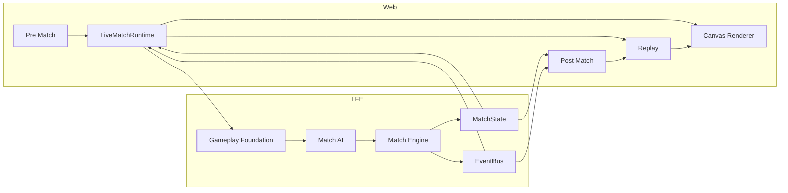
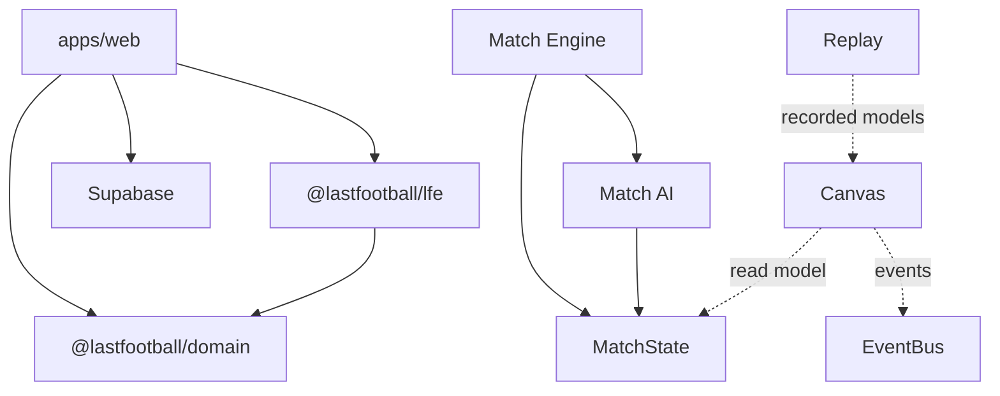

# Architecture — Last Football

## Cel dokumentu

Architektura systemu: web, LFE, Supabase, przepływ meczu Live → Canvas → Replay → Post Match.

## Aktualny stan

Monorepo z granicami pakietów. LFE = headless engine (`0.9.1-match-ai01`). Web = shell + **match pipeline** (runtime, canvas, replay, post match).

---

## Komponenty

### Frontend (`apps/web`)

- Next.js 15 App Router.
- Shell: Asset Pack, TopBar, LeftNav, Right rail.
- Match: Pre Match, Live (`LiveMatchFoundation`), Post Match.
- `/status` → `getEngineStatus()`.

### LFE (`packages/lfe`)

Headless: config, core, rng, events, scheduler, world, simulation, domain, state machine, commands, session, positioning, **gameplay**, **ai**, **match/engine**.

### Canvas (web)

Warstwa renderu 2D. Czyta `MatchCanvasReadModel`. **Nie** mutuje MatchState. Tryby: `live` | `replay`.

### Replay (web)

Ring buffer `MatchCanvasReadModel` + controller. **Nie** woła Match Engine.

### Post Match (web)

Raport z EventBus/MatchState; seek do Replay.

### Supabase

Auth/data — **nie** zależność LFE.

---

## Przepływ meczu (end-to-end)



### Tekstowo

```
Pre Match
  ↓
Gameplay Foundation
  ↓
Match AI → Match Engine → MatchState + EventBus
  ↓
LiveMatchRuntime
  ↓
Canvas Renderer (LIVE) + ReplayBuffer
  ↓
Replay Controller (REPLAY) → Canvas
  ↓
Post Match → (opcjonalnie) Replay seek
```

---

## Zależności modułów



**Hard:** Engine → AI.  
**Forbidden:** Canvas → Engine/AI; Replay → `session.run`.

---

## Simulation pipeline (LFE tick)

```
Clock → Scheduler → Lifecycle → MatchEngineSystem → Event → Replay(snapshot world)
```

Szczegóły: [`lfe/ENGINE_PIPELINE.md`](./lfe/ENGINE_PIPELINE.md) · [`lfe/GAMEPLAY_MATCH_STACK.md`](./lfe/GAMEPLAY_MATCH_STACK.md)

---

## Najważniejsze decyzje

1. Session = jedyna fasada meczu.
2. Canvas / Replay poza pakietem LFE.
3. Domain manager ≠ match domain.
4. PUBLIC freeze nadal obowiązuje; nowe eksporty AI/Engine są rozszerzeniem powierzchni — dokumentuj świadomie.

## Powiązania

[`architecture/SYSTEM_OVERVIEW.md`](./architecture/SYSTEM_OVERVIEW.md) · [`architecture/DEPENDENCIES.md`](./architecture/DEPENDENCIES.md) · [`web/MATCH_UI_PIPELINE.md`](./web/MATCH_UI_PIPELINE.md) · [`AI-HANDOFF.md`](./AI-HANDOFF.md)

## Last updated

2026-07-23 — LFE-DOCS-SYNC-01
