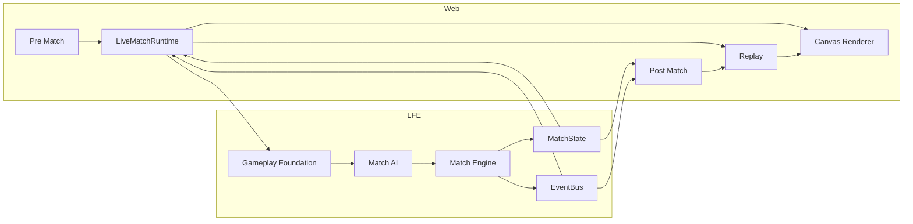
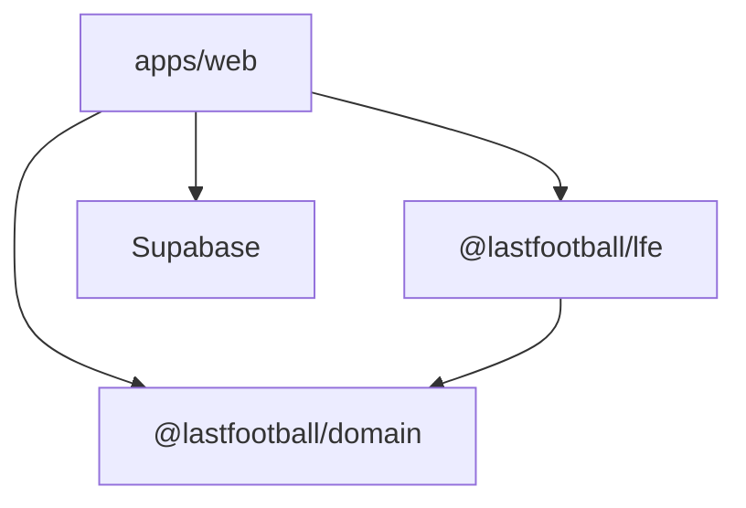

# Architecture — Last Football

## Cel dokumentu

Architektura systemu: web platform (auth/club/hub), LFE, Supabase, przepływ meczu Live → Canvas → Replay → Post Match.

## Aktualny stan

Monorepo. Production baseline **`b6b92dc`** (LFE-HUB-01).  
LFE = headless engine (`0.9.1-match-ai01`). Web = onboarding + First Match + Hub EARLY_CLUB + match pipeline.

---

## Komponenty

### Frontend (`apps/web`)

- Next.js 15 App Router.
- **Platform:** Landing, Auth, Club Wizard, First Match tunnel, Hub EARLY_CLUB.
- **Shell:** TopBar / LeftNav / Right rail — progressive unlock per Hub phase.
- **Match:** Pre Match, Live (`LiveMatchFoundation` + `LiveMatchRuntime`), Post Match.
- `/status` → `getEngineStatus()`.

### LFE (`packages/lfe`)

Headless: config, core, rng, events, scheduler, world, simulation, domain, state machine, commands, session, positioning, **gameplay**, **ai**, **match/engine**.

### Canvas / Replay / Post Match (web)

Canvas i Replay są **read-only** względem Engine. Post Match buduje raport z EventBus/MatchState.

### Supabase

Auth + `clubs` (identity, `first_match_completed_at`). **Nie** jest zależnością LFE.

---

## Przepływ gracza (platform)

```
Landing → Auth → Welcome → Club Wizard
  → First Match Intro → Prematch/Live/Post
  → Welcome LF → Hub EARLY_CLUB
```

SSOT unlock Hub: `clubs.first_match_completed_at`.  
Hub phase: `resolveHubPhase` · Primary: `resolvePrimaryCta`.

Szczegóły: [`platform/ONBOARDING_FLOW.md`](./platform/ONBOARDING_FLOW.md) · [`platform/HUB.md`](./platform/HUB.md).

---

## Przepływ meczu (end-to-end)



### Tekstowo

```
Pre Match (fixture | createSessionFromFirstMatch)
  ↓
Gameplay Foundation
  ↓
Match AI → Match Engine → MatchState + EventBus
  ↓
LiveMatchRuntime
  ↓
Canvas Renderer (LIVE) + ReplayBuffer
  ↓
Replay Controller (REPLAY) → Canvas
  ↓
Post Match → (opcjonalnie) Replay seek
  ↓ (first match) completeFirstMatch → Welcome LF → Hub
```

---

## Zależności



## Powiązania

[`AI/ARCHITECTURE_RULES.md`](./AI/ARCHITECTURE_RULES.md) · [`architecture/SYSTEM_OVERVIEW.md`](./architecture/SYSTEM_OVERVIEW.md) · [`web/MATCH_UI_PIPELINE.md`](./web/MATCH_UI_PIPELINE.md)

## Last updated

2026-07-24 — LFE-DOCS-01
