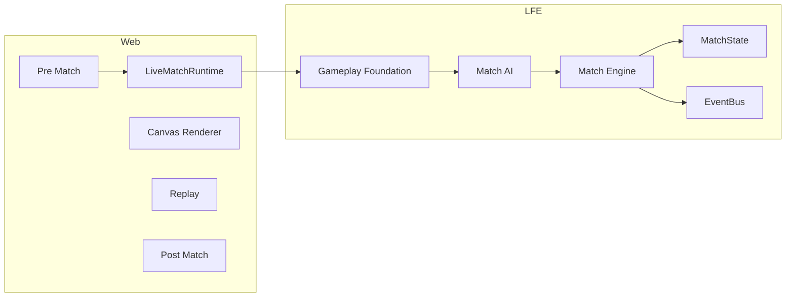
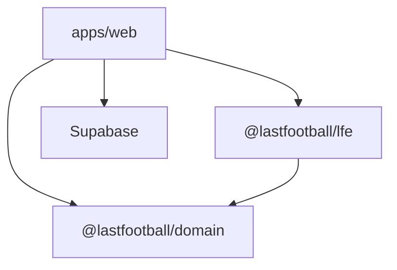

# Architecture — Last Football

## Cel dokumentu

Architektura systemu: web platform (auth/club/hub), LFE, Supabase, przepływ meczu Live → Canvas → Replay → Post Match.

## Aktualny stan

Monorepo. Feature baseline **`393a43c`** (LFE-TRANSFERS-01). Tip docs/style may be newer — [`AI/CURRENT_BASELINE.md`](./AI/CURRENT_BASELINE.md).  
LFE = headless engine. Web = platform Thin domains + match pipeline.

Filozofia / wzorce: [`AI/ARCHITECTURE_PRINCIPLES.md`](./AI/ARCHITECTURE_PRINCIPLES.md) · [`AI/COMMON_PATTERNS.md`](./AI/COMMON_PATTERNS.md).
Platforma: [`platform/HUB.md`](./platform/HUB.md) · [`LEAGUE`](./platform/LEAGUE.md) · [`FINANCE`](./platform/FINANCE.md) · [`PLAYERS`](./platform/PLAYERS.md) · [`TRANSFERS`](./platform/TRANSFERS.md).

---

## Komponenty

### Frontend (`apps/web`)

- Next.js 15 App Router.
- **Platform:** Landing, Auth, Club Wizard, First Match tunnel, Hub (EARLY_CLUB / SEASON), `/league`, `/finance`, `/squad`, `/transfers`.
- **Shell:** TopBar / LeftNav / Right rail — progressive unlock per Hub phase (+ transfer window).
- **Match:** Pre Match, Live (`LiveMatchFoundation` + `LiveMatchRuntime`), Post Match.
- `/status` → `getEngineStatus()`.

### LFE (`packages/lfe`)

Headless: config, core, rng, events, scheduler, world, simulation, domain, state machine, commands, session, positioning, **gameplay**, **ai**, **match/engine**.

### Canvas / Replay / Post Match (web)

Canvas i Replay są **read-only** względem Engine. Post Match buduje raport z EventBus/MatchState.

### Supabase

Auth + `clubs` (identity, `first_match_completed_at`, **`cash_balance`**, **`transfer_window_open`**) + **`fixtures`** + **`finance_movements`** + **`players`** + **`transfer_deals`**. **Nie** jest zależnością LFE.

---

## Przepływ gracza (platform)

```
Landing → Auth → Welcome → Club Wizard
  → First Match Intro → Prematch/Live/Post
  → Welcome LF → Hub (EARLY_CLUB → SEASON gdy fixtures)
  → /league ← resolveLeagueTable()
  → /finance ← resolveClubFinance()
  → /squad ← resolveClubSquad(rows from players)
  → /transfers ← resolveTransferMarket() (gdy transfer_window_open)
```

SSOT unlock Hub: `clubs.first_match_completed_at`.  
Hub phase: `resolveHubPhase(club, { hasFixtures })` · Session: `resolveHubSession` · Primary: `resolvePrimaryCta`.  
Fixtures: `fixtures` / `getNextFixture` · Table: `resolveLeagueTable` · Cash: `cash_balance` · Finance UI: `resolveClubFinance` · Roster: `players` · Squad UI: `resolveClubSquad` · Transfers: `resolveTransferMarket` / `transfer_window_open`.

Szczegóły: [`platform/ONBOARDING_FLOW.md`](./platform/ONBOARDING_FLOW.md) · [`platform/HUB.md`](./platform/HUB.md).

---

## Przepływ meczu (end-to-end)


```mermaid
flowchart LR
  subgraph Web
    Pre[Pre Match]
    Live[LiveMatchRuntime]
    Canvas[Canvas Renderer]
    Rep[Replay]
    Post[Post Match]
  end
  subgraph LFE
    GF[Gameplay Foundation]
    AI[Match AI]
    EN[Match Engine]
    MS[MatchState]
    EB[EventBus]
  end
  Pre --> Live
  Live --> GF
  GF --> AI
  AI --> EN
  EN --> MS
  EN --> EB
```

Szczegóły: [`web/MATCH_UI_PIPELINE.md`](./web/MATCH_UI_PIPELINE.md).

LiveMatchRuntime
↓
Canvas Renderer (LIVE) + ReplayBuffer
↓
Replay Controller (REPLAY) → Canvas
↓
Post Match → (opcjonalnie) Replay seek
↓ (first match) completeFirstMatch → Welcome LF → Hub

---

## Zależności


```mermaid
flowchart TB
  web[apps/web]
  lfe["@lastfootball/lfe"]
  dom["@lastfootball/domain"]
  sb[Supabase]
  web --> lfe
  web --> dom
  web --> sb
  lfe --> dom
```

## Powiązania

[`AI/ARCHITECTURE_RULES.md`](./AI/ARCHITECTURE_RULES.md) · [`architecture/SYSTEM_OVERVIEW.md`](./architecture/SYSTEM_OVERVIEW.md) · [`web/MATCH_UI_PIPELINE.md`](./web/MATCH_UI_PIPELINE.md)

## Last updated

2026-07-25 — AI-DOCS-HYGIENE-01
