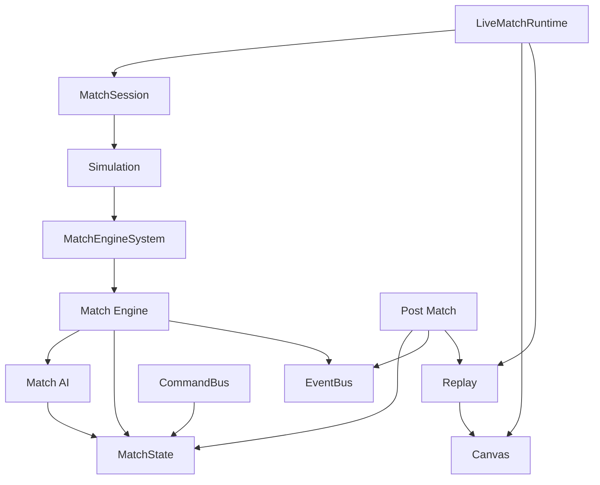

# Dependencies — Last Football

## Cel dokumentu

Zależności między pakietami, modułami meczu i zewnętrznymi usługami.

## Aktualny stan

npm workspaces; LFE zależy od domain; web zależy od LFE + domain; LFE **nie** zależy od web/supabase.  
Match Engine **hard-depends** on Match AI.

## Opis działania

### Graf pakietów

```
apps/web
  ├── @lastfootball/lfe
  └── @lastfootball/domain

@lastfootball/lfe
  └── @lastfootball/domain   (TeamId itd. — cienkie ID)

@lastfootball/domain
  └── (brak zależności na lfe/web)
```

### Graf modułów meczu



| From → To            | Dozwolone?         |
| -------------------- | ------------------ |
| Engine → AI          | **TAK** (wymagane) |
| AI → Engine          | NIE (AI czyste)    |
| Canvas → Engine/AI   | **NIE**            |
| Replay → session.run | **NIE**            |
| web → lfe deep paths | **NIE**            |
| lfe → web / supabase | **NIE**            |

### Zakazy importu (pakiety)

| From → To             | Dozwolone?                     |
| --------------------- | ------------------------------ |
| lfe → web             | **NIE**                        |
| lfe → supabase client | **NIE**                        |
| domain → lfe          | **NIE**                        |
| web → lfe deep paths  | **NIE** (tylko package export) |
| web → domain          | TAK                            |

### Zewnętrzne

| Usługa              | Użycie                 |
| ------------------- | ---------------------- |
| Vercel              | Hosting `apps/web`     |
| Supabase            | Auth/DB (app), nie LFE |
| GitHub Actions      | CI validate            |
| Vitest / TypeScript | Dev                    |

## Najważniejsze decyzje

Granice importów = część Architecture Freeze / foundation + reguły Canvas/Replay.

## Powiązania

[`../ARCHITECTURE.md`](../ARCHITECTURE.md) · [`../PROJECT_STRUCTURE.md`](../PROJECT_STRUCTURE.md) · [SYSTEM_OVERVIEW.md](./SYSTEM_OVERVIEW.md)

## Last updated

2026-07-23 — LFE-DOCS-SYNC-01
