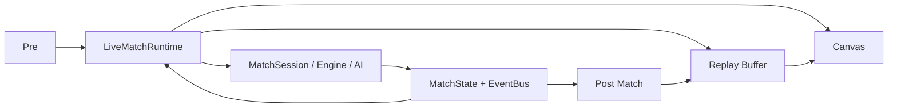

# System Overview

## Cel dokumentu

Wysokopoziomowy widok systemu Last Football (ludzie + agenci).

## Aktualny stan

Cztery płaszczyzny: **Product (GDD)**, **Engine (LFE)**, **Match UI (web gameplay)**, **Platform (Web shell + Supabase + Vercel)**.

## Opis działania

```
┌──────────────────────────────────────────────────────────────┐
│                    apps/web (React/Next)                     │
│  Shell · Pre Match · Live · Canvas · Replay · Post Match     │
│  /status → getEngineStatus()                                 │
└────────────────────────────┬─────────────────────────────────┘
                             │ PUBLIC API (createMatch, …)
                             ▼
┌──────────────────────────────────────────────────────────────┐
│                 packages/lfe (headless)                      │
│  Session → Commands → SM → Simulation                        │
│  → MatchEngineSystem → Match AI + Match Engine               │
│  → MatchState + EventBus (+ world Replay snapshots)          │
└────────────────────────────▲─────────────────────────────────┘
                             │ DTOs (nie model meczu)
┌──────────────────────────────────────────────────────────────┐
│                   packages/domain                            │
└──────────────────────────────────────────────────────────────┘

┌──────────────────────────────────────────────────────────────┐
│  supabase/ · vercel · docs/ SSOT                             │
└──────────────────────────────────────────────────────────────┘
```

### Przepływ danych meczu



## Najważniejsze decyzje

- Silnik nie zna platformy.
- Design nie jest kodem.
- Platforma nie definiuje reguł meczu — LFE + GDD.
- Canvas/Replay nie mutują LFE.

## Powiązania

[`../ARCHITECTURE.md`](../ARCHITECTURE.md) · [DEPENDENCIES.md](./DEPENDENCIES.md) · [`../web/MATCH_UI_PIPELINE.md`](../web/MATCH_UI_PIPELINE.md)

## Last updated

2026-07-23 — LFE-DOCS-SYNC-01
