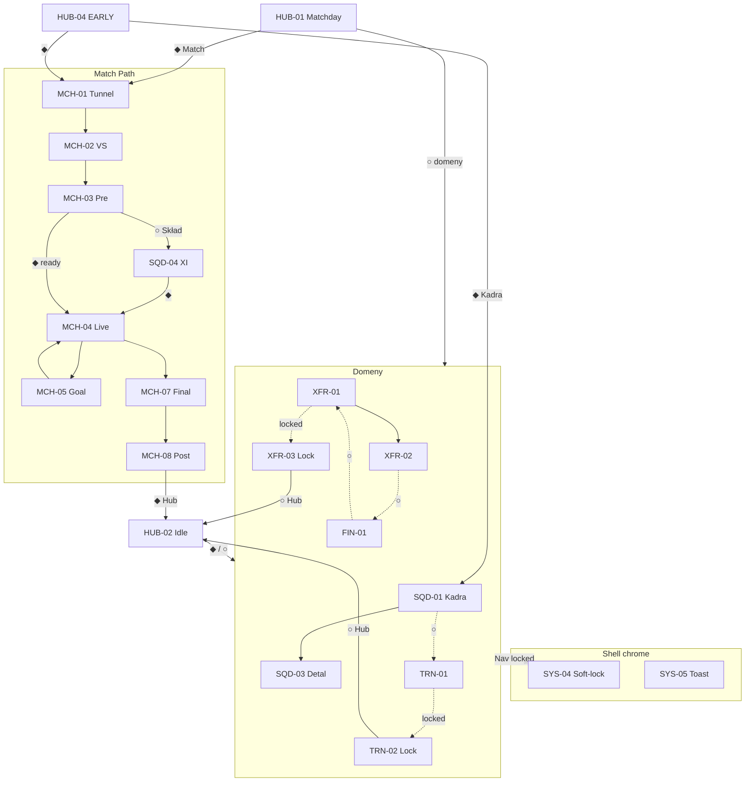
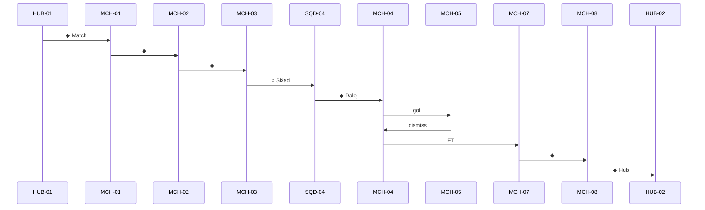

# LFE-UI-PROTO-01 — FLOW MAP

**EPIC:** LFE-UI-PROTO-01  
**Data:** 2026-07-29  
**Status:** DRAFT — mapa przepływów interaktywnego prototypu P0  

> Spec: [`LFE-UI-PROTO-01-PROTOTYPE-SPEC.md`](./LFE-UI-PROTO-01-PROTOTYPE-SPEC.md)  
> Interactions: [`LFE-UI-PROTO-01-INTERACTION-SPECS.md`](./LFE-UI-PROTO-01-INTERACTION-SPECS.md)  
> Wireframe flows: [`LFE-UI-WIREFRAMES-01-FLOWS.md`](./LFE-UI-WIREFRAMES-01-FLOWS.md)  

**Legenda:** ◆ = Primary · ○ = Secondary / Soft · → = przejście · ↩ = powrót

---

## 0. Mapa globalna P0



---

## 1. FLOW-A — Daily Manager Loop

| Pole | Wartość |
| ---- | ------- |
| **Wejście** | `MODE-B` → SCR-HUB-02 (lub po FLOW-C) |
| **Cel** | Jedna sprawa dnia → domena → powrót Hub |
| **Kroki** | 1 Hub Decision · 2 Secondary/Primary → domena · 3 decyzja domeny · 4 ↩ Hub |
| **Przejścia** | Hub↔SQD/TRN/XFR/FIN · soft-linki między domenami |
| **Stany** | Hub default · domena default/loading · empty SQD/FIN |
| **Powrót** | Soft Hub · Nav Hub · crest |
| **Błędy** | Toast SYS-05 na settle fail (mock) → zostaje na ekranie |
| **Soft-lock** | Nav/Secondary locked → SYS-04 lub lokalny TRN-02/XFR-03 |

```
[HUB-02]
  ◆ Primary (np. Trening) → [TRN-01] →◆ settle → [HUB-02]
  ○ Kadra → [SQD-01] → wiersz → [SQD-03] → Back → [SQD-01] → Hub
  ○ Transfery → [XFR-01|XFR-03]
  ○ Finanse → [FIN-01]
```

---

## 2. FLOW-B — Hub Matchday Decision

| Pole | Wartość |
| ---- | ------- |
| **Wejście** | `MODE-A` → SCR-HUB-01 |
| **Cel** | Sprawa meczu → wejście Match Path |
| **Kroki** | Hero · Decision VS/sprawa · ◆ Idź do meczu · (opcjonalnie ○ przed meczem) |
| **Przejścia** | ◆ → MCH-01 · ○ → domeny · locked Secondary → SYS-04 |
| **Stany** | default (+ FLD-003 wash) · loading LOD-004 · Secondary soft |
| **Powrót** | z domen Soft Hub (nie z Tunnel wstecz do Hub bez świadomego exit — Tunnel = forward) |
| **Błędy** | Toast; Hub zostaje |
| **Soft-lock** | Secondary disabled look · tap → SYS-04 |

**EARLY (`MODE-C` HUB-04):** to samo drzewo bez KPI mid-season; Primary często First Match lub Kadra.

---

## 3. FLOW-C — Match Path (Pre → Live → Post)

| Pole | Wartość |
| ---- | ------- |
| **Wejście** | HUB-01/04 ◆ → MCH-01 |
| **Cel** | Kompletna pętla meczu → HUB-02 |
| **Powrót** | MCH-08 ◆ Hub → HUB-02; z SQD-04 Back → MCH-03 |
| **Błędy** | MCH-01 error → Retry ◆; Live reconnect strip |
| **Soft-lock** | Nav podczas Live: limited; locked domeny → SYS-04 jeśli dostępne |

### Kroki i przejścia

| # | Ekran | Stan | Hotspot | Next |
| - | ----- | ---- | ------- | ---- |
| 1 | MCH-01 Tunnel | default / LOD-002 / error | ◆ Wejdź | MCH-02 (error: retry ten sam) |
| 2 | MCH-02 VS | default | ◆ | MCH-03 |
| 3 | MCH-03 Pre | default / Primary disabled | ○ Skład · ◆ Start (gdy ready) | SQD-04 / MCH-04 |
| 4 | SQD-04 XI | default / warn | ◆ Dalej · Back | MCH-04 / MCH-03 |
| 5 | MCH-04 Live | live / reconnect | auto gol · auto FT | MCH-05 / MCH-07 |
| 6 | MCH-05 Goal | overlay | tap / auto | MCH-04 |
| 7 | MCH-07 Final | default | ◆ | MCH-08 |
| 8 | MCH-08 Post | default | ◆ Hub | HUB-02 |

**Martwe ścieżki:** zakazane — każdy frame ma next lub dismiss.  
**Nieosiągalne:** HT (P1) — nie linkować.



---

## 4. FLOW-D — Squad

| Pole | Wartość |
| ---- | ------- |
| **Wejście** | Hub ○/◆ Kadra · Nav Squad · soft z TRN |
| **Kroki** | Lista → detal → Back; soft Trening |
| **Przejścia** | SQD-01↔SQD-03 · ○ TRN-01 · Nav Hub |
| **Stany** | default · skeleton · empty EMP-002 |
| **Powrót** | Back detal→lista · Soft/Nav→Hub |
| **Błędy** | Toast; detal error → Back lista |
| **Soft-lock** | n/a lokalny; Nav inne locked → SYS-04 |

**SQD-04** należy do FLOW-C (nie z Hub Nav jako „Kadra”).

---

## 5. FLOW-E — Training

| Pole | Wartość |
| ---- | ------- |
| **Wejście** | Hub ○ · Nav · soft SQD |
| **Kroki open** | TRN-01 pytanie · ◆ · settle loading · Hub |
| **Kroki locked** | TRN-02 SoftLockState · ○ Hub |
| **Przejścia** | open/locked wg `MODE-D` vs daily |
| **Stany** | default · settle · soft-lock |
| **Powrót** | ○ Hub / Soft |
| **Błędy** | Toast na settle fail |
| **Soft-lock** | **TRN-02** lub SYS-04 z Nav |

---

## 6. FLOW-F — Transfers

| Pole | Wartość |
| ---- | ------- |
| **Wejście** | Hub ○ · Nav · soft FIN |
| **Open** | XFR-01 → wiersz → XFR-02 → Accept modal ◆ → toast/settle → XFR-01 lub Hub |
| **Reject** | XFR-02 ○ Reject → XFR-01 |
| **Locked** | XFR-03 · ○ Hub (`MODE-E`) |
| **Stany** | inbox default · modal · soft-lock |
| **Powrót** | Back detal→inbox · ○ Hub |
| **Błędy** | Toast + modal zostaje / zamyka wg INTERACTION |
| **Soft-lock** | **XFR-03** |

---

## 7. FLOW-G — Finance

| Pole | Wartość |
| ---- | ------- |
| **Wejście** | Hub ○ · Nav · soft XFR |
| **Kroki** | FIN-01 pytanie + 1 kasa · ◆ (mock) · ○ Transfery |
| **Przejścia** | ○ → XFR-01/XFR-03 · Hub |
| **Stany** | default · LOD-007 · empty EMP-003 |
| **Powrót** | Soft Hub |
| **Błędy** | Toast |
| **Soft-lock** | tylko jeśli Nav locked → SYS-04 |

---

## 8. FLOW-H — Soft-lock global

| Pole | Wartość |
| ---- | ------- |
| **Wejście** | tap NavItem/Secondary disabled |
| **Kroki** | Modal/Sheet SYS-04 · copy + ICO-020 · ○ Wróć / Hub |
| **Przejścia** | dismiss → poprzedni frame (bez „odblokuj”) |
| **Stany** | modal only |
| **Powrót** | Wróć = poprzedni · Hub = HUB-02/01 wg mode |
| **Błędy** | n/a |
| **Soft-lock** | **to jest** soft-lock |

Lokalne ekrany TRN-02 / XFR-03 **zastępują** pełny SYS-04 gdy wejście bezpośrednie w lokację — nie dublować obu naraz.

---

## 9. Macierz przejść (kompletność)

| From | To | Trigger | Viewport |
| ---- | -- | ------- | -------- |
| HUB-01 | MCH-01 | ◆ | D+M |
| HUB-01 | SQD/TRN/XFR/FIN | ○ / Nav | D+M |
| HUB-02 | domeny | ◆/○/Nav | D+M |
| HUB-04 | MCH-01 / SQD-01 | ◆ | D+M |
| HUB-* | SYS-04 | locked tap | D+M |
| MCH-01 | MCH-02 | ◆ | D+M |
| MCH-01 | MCH-01 | error Retry ◆ | D+M |
| MCH-02 | MCH-03 | ◆ | D+M |
| MCH-03 | SQD-04 | ○ Skład | D+M |
| MCH-03 | MCH-04 | ◆ ready | D+M |
| SQD-04 | MCH-03 | Back | D+M |
| SQD-04 | MCH-04 | ◆ | D+M |
| MCH-04 | MCH-05 | gol hotspot/auto | D+M |
| MCH-05 | MCH-04 | dismiss | D+M |
| MCH-04 | MCH-07 | FT | D+M |
| MCH-07 | MCH-08 | ◆ | D+M |
| MCH-08 | HUB-02 | ◆ | D+M |
| SQD-01 | SQD-03 | row | D+M |
| SQD-03 | SQD-01 | Back | D+M |
| SQD-01/03 | TRN-01 | ○ | D+M |
| TRN-01 | HUB-02 | ◆ after settle | D+M |
| * | TRN-02 | locked Training | D+M |
| TRN-02 | HUB-02 | ○ | D+M |
| XFR-01 | XFR-02 | row | D+M |
| XFR-02 | XFR-01 | Reject / Back | D+M |
| XFR-02 | modal→XFR-01/Hub | Accept ◆ | D+M |
| * | XFR-03 | locked Transfers | D+M |
| XFR-03 | HUB-02 | ○ | D+M |
| FIN-01 | XFR-* | ○ | D+M |
| * | SYS-05 | error mock | D+M overlay |

---

## 10. Checklist martwych / nieosiągalnych

| Check | Status |
| ----- | ------ |
| Każdy P0 node ma ≥1 wejście z Mode lub Nav | ✓ (patrz modes) |
| Każdy P0 node ma wyjście | ✓ |
| HT / Academy / Medical nie linkowane | ✓ |
| SQD-04 tylko z Match Path | ✓ |
| Soft-lock zawsze z CTA wyjścia | ✓ |
| Overlay Goal nie zatrzymuje pętli | ✓ dismiss→Live |

---

## Historia

| Wersja | Data | Opis |
| ------ | ---- | ---- |
| 0.1.0 | 2026-07-29 | Flow Map P0 prototyp |
