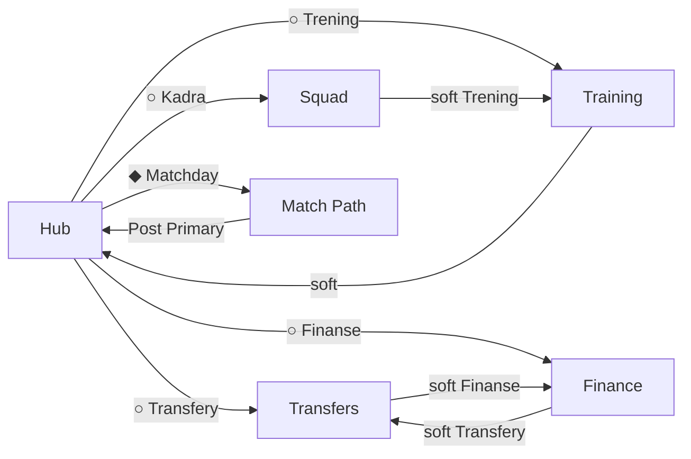
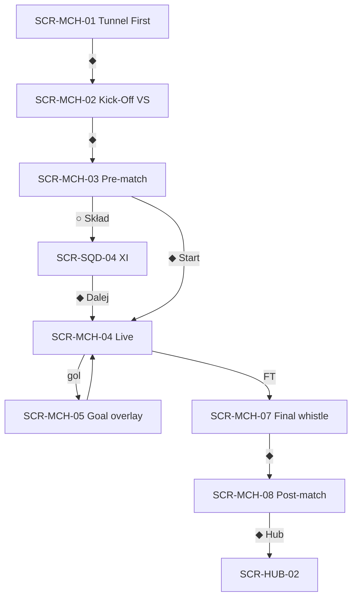

# LFE-UI-WIREFRAMES-01 — USER FLOWS

**EPIC:** LFE-UI-WIREFRAMES-01  
**Data:** 2026-07-29  
**Zakres:** P0 — pętla dzienna + Match Path

> IA: [`LFE-UI-WIREFRAMES-01-IA.md`](./LFE-UI-WIREFRAMES-01-IA.md)  
> Wireframes: [`LFE-UI-WIREFRAMES-01-WIREFRAMES.md`](./LFE-UI-WIREFRAMES-01-WIREFRAMES.md)

---

## 0. Legenda

```
[Ekran]    krok UI
(decision) wybór gracza
{system}   resolver / unlock / settlement (bez zmian w tym EPICu)
→          przejście
◆          Primary CTA
○          Secondary / soft-link
```

---

## 1. Flow A — Daily Manager Loop



**Cel:** w ≤2 klikach z Hubu wejść w dowolny węzeł P0.

**Zasady:**

- Soft-linki łączą sąsiadów — nie dodają drugiego Primary.
- Soft-lock na węźle → SCR-SYS-04 / lokalny SoftLockState → powrót Hub lub wyjaśnienie.

---

## 2. Flow B — Hub decision (dzień meczowy)

```
[SCR-HUB-01]
  Hero: najbliższy mecz / sprawa
  Decision: ◆ Idź do meczu
  Secondary: ○ Trening ○ Kadra ○ Transfery ○ Finanse ○ Terminarz
        │
        ├─◆→ Match Path (Flow C)
        └─○→ odpowiedni ekran P0
```

**Idle / po meczu (SCR-HUB-02):** Primary może wskazywać Kadra / Trening / następną sprawę — nadal **jedno** Primary.

**EARLY_CLUB (SCR-HUB-04):** bez mid-season KPI mock; Primary zgodne z resolverem (często First Match / Kadra).

---

## 3. Flow C — Match Path (pre → live → post)



**Warianty:**

| Warunek                        | Ścieżka                                  |
| ------------------------------ | ---------------------------------------- |
| First Match (przed Hub unlock) | MCH-01 → … → post → Hub unlock           |
| Matchday z Hubu                | Hub ◆ → MCH-02 (lub checklist) → …       |
| Soft-lock składu               | SQD-04 / modal SYS-04 — bez nowych reguł |

**Live:** ograniczone akcje UI; feedback przez overlay (gol) i chip Live.

---

## 4. Flow D — Squad

```
[SCR-SQD-01 Kadra lista]
  Decision: pytanie dnia (np. gotowość)
  Context: lista PlayerRow
        │
        ├─ tap wiersz → [SCR-SQD-03 Detal]
        │                  └─○ Trening → SCR-TRN-01
        │                  └─ wstecz → SQD-01
        └─○ soft Trening → SCR-TRN-01

[SCR-SQD-04 Skład XI]  ← tylko z Match Path
  Decision: ustaw XI
  ◆ Zapisz / Dalej → Live
```

---

## 5. Flow E — Training

```
{resolveNavAccess}
    │
    ├─ locked → [SCR-TRN-02 Soft-lock] →○ Hub
    └─ open → [SCR-TRN-01]
                ◆ Sesja → {settle training}
                → potwierdzenie / empty (P1) →○ Hub / Kadra
```

---

## 6. Flow F — Transfers

```
{window open?}
    │
    ├─ no → [SCR-XFR-03 Okno zamknięte] →○ Hub
    └─ yes → [SCR-XFR-01 Inbox]
                │
                └─ oferta → [SCR-XFR-02 Detal]
                              ◆ Accept → {settle} → XFR-01 / Hub
                              ○ Reject → XFR-01
                              (P1 kontroferta → osobny krok)
```

Soft-link z detalu: ○ Finanse · ○ Kadra.

---

## 7. Flow G — Finance

```
[SCR-FIN-01]
  Decision: pytanie o kasę / priorytet
  Context: kategorie / ruchy
  ○ Transfery → SCR-XFR-01
  ○ Hub
```

---

## 8. Flow H — Soft-lock global

```
Nav / Secondary do zablokowanej lokacji
  → [SCR-SYS-04]
       copy: dlaczego + kiedy
       ○ Wróć
       ○ Hub (opcjonalnie)
```

IA nie definiuje dat unlock — tylko prezentuje wynik resolvera.

---

## 9. Macierz przejść P0 (skrót)

| From        | To                               | Trigger           |
| ----------- | -------------------------------- | ----------------- |
| Hub         | Match Path                       | Primary matchday  |
| Hub         | Training/Squad/Transfers/Finance | Secondary         |
| Training    | Hub / Squad                      | Soft-link         |
| Squad       | Training                         | Soft-link         |
| Squad detal | Squad lista                      | Back / breadcrumb |
| Transfers   | Finance                          | Soft-link         |
| Finance     | Transfers                        | Soft-link         |
| Post-match  | Hub                              | Primary           |
| Any locked  | Soft-lock                        | Nav attempt       |

---

## Historia

| Wersja | Data       | Opis                              |
| ------ | ---------- | --------------------------------- |
| 0.1.0  | 2026-07-29 | Flows P0 · daily · match · domeny |
