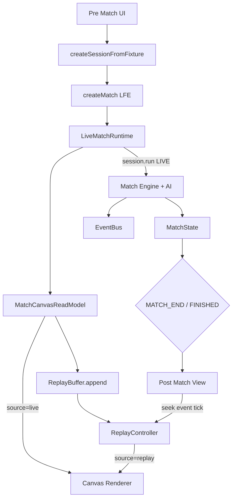

# Web — Match UI Pipeline (Canvas · Replay · Post Match)

## Cel dokumentu

Dokumentacja warstwy **aplikacji** (`apps/web`) dla przebiegu meczu Live → Canvas → Replay → Post Match.

**Nie** jest częścią pakietu `@lastfootball/lfe`.

## Aktualny stan

| Moduł                          | Status            | Hash (orient.)          |
| ------------------------------ | ----------------- | ----------------------- |
| LiveMatchRuntime + Live Bridge | ✅ DONE na `main` | `33618e9` (+ RELEASE C) |
| Canvas Renderer 2D             | ✅ DONE na `main` | `d752d22`               |
| Replay Buffer + Controller     | ✅ DONE na `main` | `cf1d68c`               |
| Post Match UI                  | ✅ DONE na `main` | `b25f479` + Ratings     |
| Player Ratings (Post Match)    | ✅ DONE (local)   | LFE-PLAYER-RATINGS-01   |

---

## Przepływ danych



---

## Moduły

### LiveMatchRuntime

|                      |                                                                                                                                                                                                                            |
| -------------------- | -------------------------------------------------------------------------------------------------------------------------------------------------------------------------------------------------------------------------- |
| **Odpowiedzialność** | Sesja LFE, pulse symulacji, snapshot UI, CommandBus z UI, zapis Replay, tryb LIVE/REPLAY                                                                                                                                   |
| **Wejścia**          | `Fixture`, `LiveMatchBundle`                                                                                                                                                                                               |
| **Wyjścia**          | `LiveMatchSnapshot`, `canvasHost.present`, replay API                                                                                                                                                                      |
| **Pliki**            | `apps/web/src/gameplay/live-match-runtime.ts`, `use-live-match-runtime.ts`, `create-session-from-fixture.ts`                                                                                                               |
| **API**              | `getSnapshot`, `subscribe`, `dispatchUiCommand`, `startSimulation`/`stopSimulation`, `enterReplay`/`exitReplay`, `replayPlay`/`Pause`/`Stop`/`Seek`/`SeekRatio`/`SetSpeed`, `getPlaybackSource`, `replayBuffer`, `dispose` |

### Canvas Host + Renderer

|                      |                                                                                                             |
| -------------------- | ----------------------------------------------------------------------------------------------------------- |
| **Odpowiedzialność** | Host DOM `#lf-match-canvas-root`; renderer 2D boisko/zawodnicy/piłka; FX EventBus; tryby `live` \| `replay` |
| **Wejścia**          | `MatchCanvasReadModel` (read-only)                                                                          |
| **Wyjścia**          | piksele Canvas (brak mutacji stanu)                                                                         |
| **Zależności**       | typy LFE (`MatchState`, `MatchSpatialState`, `EngineEvent`) — **bez** Engine/AI                             |
| **Pliki**            | `canvas-host.ts`, `gameplay/canvas/*`                                                                       |
| **API**              | `createMatchCanvasHost`, `createMatchCanvasRenderer`, `present`, `setPlaybackMode`                          |

### Replay

|                      |                                                                       |
| -------------------- | --------------------------------------------------------------------- |
| **Odpowiedzialność** | Ring buffer klatek; play/pause/stop/seek/speed; **bez** `session.run` |
| **Wejścia**          | kolejne `MatchCanvasReadModel` z LIVE                                 |
| **Wyjścia**          | `onPresent(model)` → Canvas                                           |
| **Pliki**            | `apps/web/src/gameplay/replay/*`                                      |
| **API**              | `createReplayBuffer`, `createReplayController`                        |

### Post Match

|                      |                                                                                             |
| -------------------- | ------------------------------------------------------------------------------------------- |
| **Odpowiedzialność** | Raport po końcu: wynik, gole, timeline, stats, **oceny XI + MVP**; skok do Replay           |
| **Wejścia**          | `MatchState` + events (+ buffer do seek)                                                    |
| **Wyjścia**          | UI; wywołania istniejącego Replay API                                                       |
| **Pliki**            | `apps/web/src/components/match/post-match/*`                                                |
| **API**              | `buildPostMatchSummary`, `computePlayerRatings`, `findReplayIndexForEvent`, `PostMatchView` |

### LiveMatchFoundation

Orkiestracja UI Live:

- montaż Canvas (`createMatchCanvasRenderer` → `canvasHost.attachRenderer`)
- panel Replay (seek / play / speed) przez API `LiveMatchRuntime`
- otwarcie **Post Match** po `FINISHED` / `MATCH_END`
- seek z timeline Post Match → `findReplayIndexForEvent` + `replaySeek`

Plik: `apps/web/src/components/match/LiveMatchFoundation.tsx`.

### Live Bridge (zasada)

`LiveMatchRuntime` jest **jedynym** miejscem, które w LIVE woła `session.run`, buduje `MatchCanvasReadModel`, robi `replayBuffer.append` i `canvasHost.present`.  
W REPLAY **nie** woła Engine — tylko controller + `present` nagranych modeli.

---

## Publiczne typy (web)

```ts
MatchCanvasReadModel = {
  matchId,
  matchState,
  spatial,
  tick,
  events,
};
```

---

## Ograniczenia

- Spatial kickoff + presentation derive (nie pełna fizyka).
- Replay tylko RAM.
- Player Ratings = pure derive w Post Match (skala 1.0–10.0, XI obu drużyn, MVP); bez assists/minutes w formule v1.

## Powiązania

[`../ARCHITECTURE.md`](../ARCHITECTURE.md) · [`../lfe/GAMEPLAY_MATCH_STACK.md`](../lfe/GAMEPLAY_MATCH_STACK.md) · [`../AI-HANDOFF.md`](../AI-HANDOFF.md)

## Last updated

2026-07-24 — LFE-PLAYER-RATINGS-01
